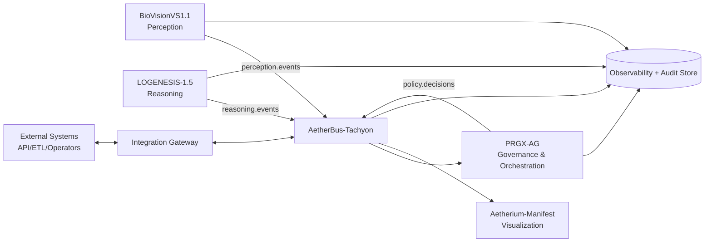

# รายงานทางการเต็มรูปแบบ: แผนเชื่อมต่อการทำงานของระบบ (ภายใน + ภายนอก)

> เอกสารฉบับนี้จัดทำเพื่อใช้เป็นกรอบปฏิบัติการร่วมระหว่างระบบในเครือ Aetherium / FGD-ATR-EP โดยเน้นการทำงานแบบ event-driven, การกำกับดูแล (governance), ความปลอดภัย และการสังเกตการณ์ระบบแบบครบวงจร

**วันที่จัดทำ:** 28 มีนาคม 2026 (UTC)  
**สถานะเอกสาร:** ฉบับใช้งาน (Operational Baseline v1.0)  
**ขอบเขตระบบที่ครอบคลุม:**
- https://github.com/Aetherium-Syndicate-Inspectra/AETHERIUM-GENESIS *(ไม่สามารถเข้าถึงเมทาดาท่าผ่าน GitHub API ได้ ณ เวลาจัดทำ)*
- https://github.com/Aetherium-Syndicate-Inspectra/AetherBus-Tachyon
- https://github.com/FGD-ATR-EP/PRGX-AG
- https://github.com/Aetherium-Syndicate-Inspectra/Aetherium-Manifest
- https://github.com/FGD-ATR-EP/LOGENESIS-1.5
- https://github.com/FGD-ATR-EP/BioVisionVS1.1

---

## 1) วัตถุประสงค์ทางยุทธศาสตร์ (Strategic Objectives)

1. รวมทุกโมดูลให้ทำงานร่วมกันได้ผ่าน **AetherBus-Tachyon** เป็นแกนกลางของ event bus
2. แยกบทบาทระบบให้ชัดเจนตามสายงาน: perception, reasoning, governance, visualization
3. กำหนดมาตรฐานสัญญาการสื่อสาร (contracts) ระหว่างระบบทั้งภายในองค์กรและภายนอก
4. เพิ่มความสามารถด้านตรวจสอบย้อนกลับ (auditability), observability และความปลอดภัย
5. รองรับการขยายตัวทั้งเชิงเทคนิค (scale) และเชิงองค์กร (multi-team, multi-tenant)

---

## 2) บทบาทหลักของแต่ละระบบ

## 2.1 BioVisionVS1.1 — Perception Engine
- บทบาท: ประมวลผลการมองเห็นแบบ biologically-inspired (ภาพนิ่ง/วิดีโอ)
- ผลลัพธ์หลัก: inference outputs, qualia-like metrics, artifacts (เช่น visual map)
- จุดเชื่อมต่อ: ส่งผลการรับรู้เข้า event bus เพื่อให้ reasoning และ governance ใช้งานต่อ

## 2.2 LOGENESIS-1.5 — Conversational Reasoning Runtime
- บทบาท: จัดลำดับการให้เหตุผล สนทนาแบบมี state และ memory gate
- ผลลัพธ์หลัก: response plans, reasoning decisions, dialogue ledger updates
- จุดเชื่อมต่อ: รับ perception events/command events แล้วสร้างผล reasoning เพื่อส่งต่อ

## 2.3 PRGX-AG — Governance + Orchestration Backend
- บทบาท: นโยบายกำกับระบบ, workflow orchestration, bounded repair/guardrail
- ผลลัพธ์หลัก: policy decisions, approvals/denials, remediation actions, audit state
- จุดเชื่อมต่อ: คั่นกลางการตัดสินใจเชิงกำกับก่อน action สำคัญถูก commit

## 2.4 AetherBus-Tachyon — Messaging Backbone
- บทบาท: ตัวกลางรับส่งข้อความแบบประสิทธิภาพสูง (topic routing)
- ผลลัพธ์หลัก: reliable event distribution ระหว่าง producer/consumer
- จุดเชื่อมต่อ: เป็นโครงกระดูกกลางของ integration ทั้งระบบ

## 2.5 Aetherium-Manifest — Cognitive Visualization Layer
- บทบาท: ชั้นแสดงผล, dashboard, explainability views, operator console
- ผลลัพธ์หลัก: ภาพรวมสถานะระบบ, trace views, governance timeline
- จุดเชื่อมต่อ: subscribe ข้อมูลจาก bus/aggregates เพื่อแสดงภาพเชิงปฏิบัติการ

## 2.6 AETHERIUM-GENESIS — Program Umbrella / Integration Vision
- บทบาท: ร่มสถาปัตยกรรมและทิศทางระดับโปรแกรม
- หมายเหตุ: ที่อยู่รีโปที่ระบุยังเข้าถึงไม่ได้ผ่าน API ณ วันที่ 28 มีนาคม 2026 จึงใช้เป็น logical parent ในเอกสารนี้

---

## 3) สถาปัตยกรรมเชิงบูรณาการ (Target Integration Architecture)



**หลักการออกแบบ:**
- **Decoupled via events:** ลดการผูกแน่น point-to-point
- **Policy-before-commit:** งานเสี่ยงสูงต้องผ่าน PRGX-AG ก่อน commit
- **Trace-first:** ทุกเหตุการณ์สำคัญต้องมี correlation ID และ audit trail
- **Human-in-the-loop:** กรณีความเสี่ยงสูงต้องมีขั้นอนุมัติจาก operator

---

## 4) มาตรฐานการเชื่อมต่อภายใน (Internal Integration Contracts)

## 4.1 Event Envelope กลาง (แนะนำให้ใช้ร่วมทุกรีโป)

```json
{
  "event_id": "uuid",
  "event_type": "domain.action.v1",
  "occurred_at": "2026-03-28T12:00:00Z",
  "producer": "service-name",
  "tenant_id": "default",
  "correlation_id": "uuid",
  "causation_id": "uuid-or-null",
  "schema_version": "1.0.0",
  "payload": {},
  "meta": {
    "priority": "normal",
    "sensitivity": "internal",
    "signature": "optional"
  }
}
```

## 4.2 Topic Namespace มาตรฐาน
- `perception.frame.processed.v1`
- `perception.scene.inferred.v1`
- `reasoning.plan.created.v1`
- `reasoning.response.finalized.v1`
- `governance.policy.evaluated.v1`
- `governance.action.approved.v1`
- `governance.action.denied.v1`
- `system.audit.recorded.v1`

## 4.3 SLO เบื้องต้น
- P95 end-to-end event latency: **< 300 ms** (ภายในคลัสเตอร์เดียว)
- Delivery success rate: **≥ 99.9%**
- Message durability (critical topics): **at-least-once + idempotent consumer**

---

## 5) มาตรฐานการเชื่อมต่อภายนอก (External Integration)

## 5.1 ช่องทางเชื่อมต่อ
1. **REST/HTTP Gateway** สำหรับระบบองค์กรทั่วไป
2. **Webhook Outbound** สำหรับแจ้งเหตุการณ์ไปแพลตฟอร์มภายนอก
3. **Batch/ETL Export** สำหรับ analytics และ data lake
4. **Operator Console Access** ผ่าน Aetherium-Manifest

## 5.2 Security Baseline
- OAuth2/OIDC สำหรับ user-to-system
- mTLS/JWT signing สำหรับ service-to-service
- Field-level encryption สำหรับข้อมูลอ่อนไหว
- RBAC + ABAC สำหรับสิทธิ์ข้ามทีม/ข้าม tenant
- Secret rotation + key lifecycle policy

## 5.3 Compliance & Audit
- บันทึก `who/what/when/why` ทุก action สำคัญ
- Immutable audit log สำหรับเหตุการณ์กำกับ
- Data retention policy แยกตามระดับความอ่อนไหว

---

## 6) ลำดับการทำงานมาตรฐาน (Reference Operational Flows)

## 6.1 Flow A — Perception-to-Decision
1. BioVisionVS1.1 ประมวลผล input และ publish `perception.scene.inferred.v1`
2. LOGENESIS-1.5 consume เหตุการณ์ สร้าง reasoning plan
3. PRGX-AG evaluate policy ของแผน/คำตอบ
4. หากผ่าน policy: emit `governance.action.approved.v1`
5. Aetherium-Manifest แสดงผล timeline + สถานะล่าสุด

## 6.2 Flow B — Governance-denied + Remediation
1. PRGX-AG ตรวจพบ violation
2. emit `governance.action.denied.v1` + remediation hints
3. LOGENESIS/BioVision ปรับพารามิเตอร์ตาม bounded repair scope
4. ส่งรอบประมวลผลใหม่ พร้อมเหตุผลเชิง audit

## 6.3 Flow C — External Request Orchestration
1. ระบบภายนอกเรียก Integration Gateway
2. Gateway แปลงคำขอเป็น normalized event
3. ส่งเข้า AetherBus และรอ callback/webhook
4. ส่งผลกลับแบบ sync หรือ async ตาม SLA

---

## 7) โมเดลข้อมูลกลาง (Canonical Data Domains)

- **Identity Domain:** user, service, role, tenant
- **Perception Domain:** asset, frame, feature, inference, qualia
- **Reasoning Domain:** context state, plan, rationale, output
- **Governance Domain:** policy, decision, violation, remediation
- **Audit Domain:** immutable events, signed records, trace graph

**ข้อกำหนดร่วม:**
- ใช้ schema registry กลาง + semantic versioning
- backward compatibility อย่างน้อย 1 major cycle
- ห้าม breaking change โดยไม่ประกาศ migration plan

---

## 8) แผนปฏิบัติการ 90 วัน (90-Day Execution Plan)

## ระยะที่ 1 (วัน 1-30): Contract & Bus Foundation
- ตกลง event envelope + topic namespace
- เชื่อม BioVisionVS1.1 และ PRGX-AG เข้ากับ AetherBus-Tachyon
- เริ่มทำ audit sink ขั้นต่ำ (append-only)

## ระยะที่ 2 (วัน 31-60): Governance Gate + Visualization
- เปิดใช้งาน policy-before-commit สำหรับ action สำคัญ
- เชื่อม LOGENESIS-1.5 กับ pipeline จริง
- ตั้ง dashboard operational ใน Aetherium-Manifest

## ระยะที่ 3 (วัน 61-90): External Gateway + Hardening
- เปิด API Gateway ภายนอกพร้อม auth ครบ
- ทำ load test, failure injection, disaster drill
- finalize runbook + SLO + incident response protocol

---

## 9) ความเสี่ยงหลักและแนวทางลดความเสี่ยง

1. **Schema Drift ระหว่างทีม**  
   แนวทาง: schema registry + compatibility checks ใน CI

2. **Event Duplication/Out-of-order**  
   แนวทาง: idempotency key + ordering key ต่อ aggregate

3. **Policy Bottleneck**  
   แนวทาง: cache policy + async pre-check + risk tiering

4. **Observability ไม่พอ**  
   แนวทาง: distributed tracing + correlation ID บังคับใช้

5. **ความไม่พร้อมของรีโปต้นทางบางตัว**  
   แนวทาง: ใช้ interface-first contract แล้วเชื่อมจริงเมื่อพร้อม

---

## 10) ตัวชี้วัดความสำเร็จ (KPIs)

- อัตราเหตุการณ์ที่ trace ครบเส้นทาง: **≥ 99%**
- เวลาตอบสนอง P95 ของ flow A: **< 2 วินาที**
- อัตราการปฏิเสธจาก governance ที่มี remediation สำเร็จใน 1 รอบ: **≥ 80%**
- MTTR เหตุขัดข้องระดับกลาง: **< 30 นาที**
- อัตราการเปลี่ยน schema ที่ผ่าน compatibility gate ก่อน deploy: **100%**

---

## 11) ข้อเสนอการกำกับโครงการ (Program Governance)

- ตั้ง **Integration Council** (Tech Lead จากทุกรีโป)
- ประชุม weekly: schema change board + incident review
- นำ RFC process เดียวกันมาใช้ข้ามรีโป
- กำหนด release train ราย 2 สัปดาห์สำหรับสัญญากลาง

---

## 12) สรุปผู้บริหาร (Executive Conclusion)

การเชื่อมต่อระบบทั้งภายในและภายนอกของเครือ Aetherium/FGD-ATR-EP สามารถเดินหน้าได้อย่างเป็นระบบ หากยึดแกน **AetherBus-Tachyon + PRGX-AG governance gate + observability กลาง** และใช้สัญญาข้อมูลเดียวกันทุกทีม โดย BioVisionVS1.1 ทำหน้าที่ perception, LOGENESIS-1.5 ทำ reasoning, Aetherium-Manifest ทำ visualization ส่วน AETHERIUM-GENESIS เป็นร่มยุทธศาสตร์ระดับโปรแกรม เมื่อดำเนินการตามแผน 90 วัน จะได้แพลตฟอร์มที่ตรวจสอบได้ ปลอดภัย ขยายได้ และพร้อมเชื่อมต่อโลกภายนอกแบบ production-grade.

---

## ภาคผนวก A: สถานะการเข้าถึงข้อมูลรีโปภายนอก ณ วันที่จัดทำ

- เข้าถึงเมทาดาท่าผ่าน GitHub API ได้:
  - AetherBus-Tachyon
  - PRGX-AG
  - Aetherium-Manifest
  - LOGENESIS-1.5
  - BioVisionVS1.1
- ไม่สามารถเข้าถึงผ่าน API ได้:
  - AETHERIUM-GENESIS (404 ณ เวลาตรวจสอบ)

> ข้อเสนอ: เมื่อรีโป AETHERIUM-GENESIS พร้อมใช้งาน ให้เพิ่มภาคผนวก B สำหรับ mapping artifact/owner/release policy ระดับโปรแกรมทันที
